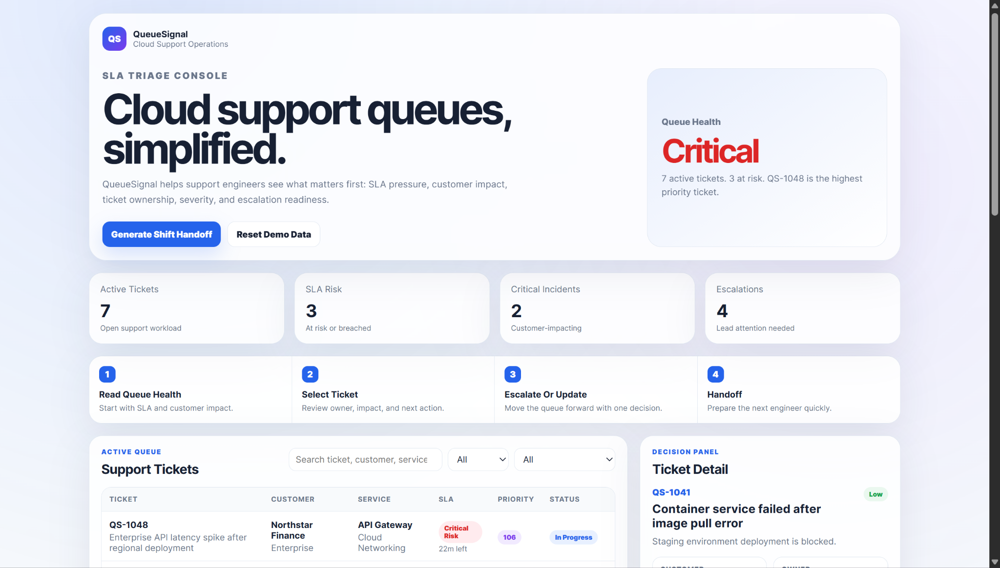
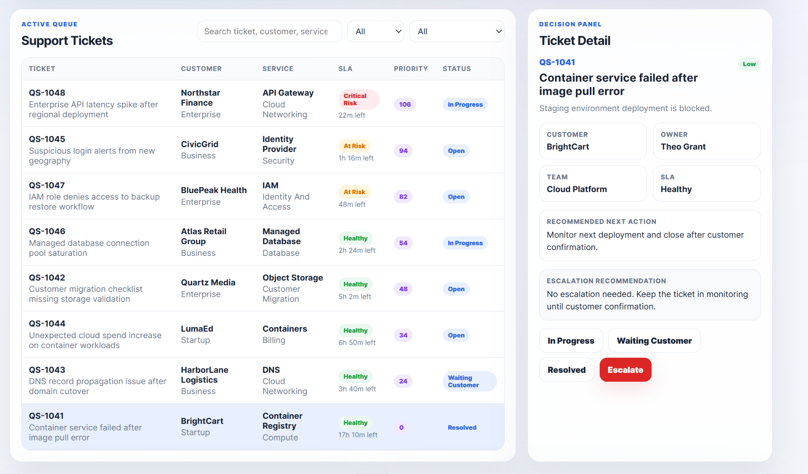
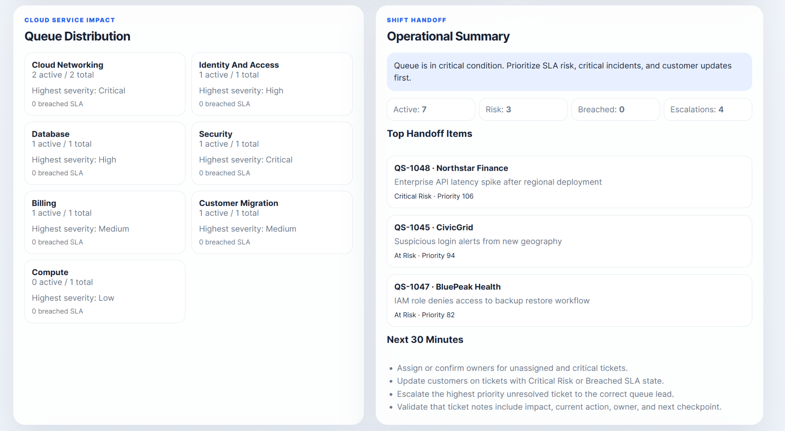

# QueueSignal Cloud Support SLA & Incident Triage Console

## Overview

QueueSignal is a full-stack cloud support work queue and incident triage console. It upgrades a simple task board into a practical support operations system for tracking ticket urgency, SLA risk, customer impact, ownership, and escalation decisions.

The project is designed to show how cloud support teams can prioritize work across incidents, customer requests, service-impacting issues, and shift handoffs.

## Screenshots

### Dashboard Overview



### Ticket Detail And Decision Panel



### Shift Handoff Summary



## Real-World Use Case

Cloud support teams need to quickly understand which tickets need action first. QueueSignal simulates that workflow by combining SLA status, customer tier, severity, service impact, ownership, and escalation level into a prioritized support queue.

QueueSignal helps answer:

- Which tickets are closest to SLA breach?
- Which customer-impacting incidents need escalation?
- Which cloud service areas are under pressure?
- Who owns each ticket?
- What should the next support engineer do during handoff?
- Which ticket deserves the next 30 minutes of attention?

## Key Features

- Full-stack Node.js and Express application
- Clean frontend dashboard served from the backend
- Cloud support ticket API
- SLA risk calculation
- Priority scoring engine
- Escalation recommendation logic
- Status update and escalation actions
- Queue summary endpoint
- Shift handoff generator
- Service impact summary
- Automated triage tests
- Docker-ready project structure

## Tech Stack

- Node.js
- Express
- JavaScript ES Modules
- HTML
- CSS
- Browser Fetch API
- Helmet
- CORS
- Docker

## Project Structure

```text
.
├── public/
│   ├── index.html
│   ├── styles.css
│   └── app.js
├── src/
│   ├── triageEngine.mjs
│   └── data/
│       └── tickets.mjs
├── tests/
│   └── triage.test.mjs
├── docs/
│   ├── architecture.md
│   └── screenshots/
├── server.mjs
├── package.json
├── Dockerfile
├── .env.example
└── README.md
```

## How To Run Locally

```powershell
npm install
npm start
```

Open the application:

```text
http://localhost:8080
```

## Run Quality Checks

```powershell
npm run check
npm test
```

## API Endpoints

| Method | Endpoint | Purpose |
|---|---|---|
| GET | `/api/health` | Confirms backend service health |
| GET | `/api/tickets` | Returns enriched support tickets |
| GET | `/api/tickets/:id` | Returns one enriched ticket |
| PATCH | `/api/tickets/:id/status` | Updates ticket status |
| POST | `/api/tickets/:id/escalate` | Raises escalation level |
| GET | `/api/queue-summary` | Returns queue health metrics |
| GET | `/api/handoff` | Generates shift handoff summary |
| POST | `/api/reset` | Resets demo ticket data |

## Logic Model

QueueSignal enriches each support ticket with:

- SLA State
- Remaining SLA Time
- Priority Score
- Recommended Queue
- Escalation Recommendation

The priority score considers:

- Ticket severity
- Customer tier
- Current status
- SLA pressure
- Escalation level

## Cloud Support Relevance

QueueSignal demonstrates practical cloud support operations:

- Incident queue visibility
- SLA-based prioritization
- Customer impact triage
- Escalation readiness
- Shift handoff summaries
- Service area pressure tracking
- Backend API design for operational tools
- Container-readiness for cloud deployment

## Docker Usage

```powershell
docker build -t queuesignal-cloud-support-console .
docker run -p 8080:8080 queuesignal-cloud-support-console
```

## Recruiter Review Points

A recruiter or technical reviewer can quickly see:

- Backend API design
- Frontend workflow clarity
- SLA and priority scoring logic
- Incident escalation thinking
- Cloud support operations relevance
- Automated tests
- Clean documentation
- Practical internal-tool design

## Planned Enhancements

- Persistent database storage for ticket history
- Authentication for internal support teams
- CI workflow for automated testing
- Cloud deployment using AWS App Runner, ECS, or Azure App Service
- Webhook-style integrations for Slack, Jira, or PagerDuty-style alerts
- Role-based dashboard views for L1, L2, and incident leads

